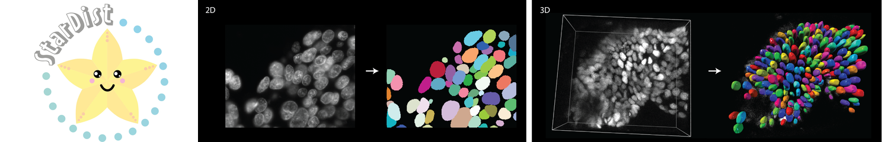

# Neubias Academy 2020
## Introduction to Nuclei Segmentation with *StarDist*

### Webinar

* Slides: TODO
* 
* Python code (Training/Prediction): [https://github.com/mpicbg-csbd/stardist](https://github.com/mpicbg-csbd/stardist)

* Fiji Plugin (Prediction): [https://imagej.net/StarDist](https://imagej.net/StarDist)

### Tutors/Contact

[Martin Weigert](mailto:martin.weigert@epfl.ch),
[Olivier Burri](mailto:olivier.burri@epfl.ch),
[Siân Culley](mailto:s.culley@ucl.ac.uk),
[Uwe Schmidt](mailto:research@uweschmidt.org), 
